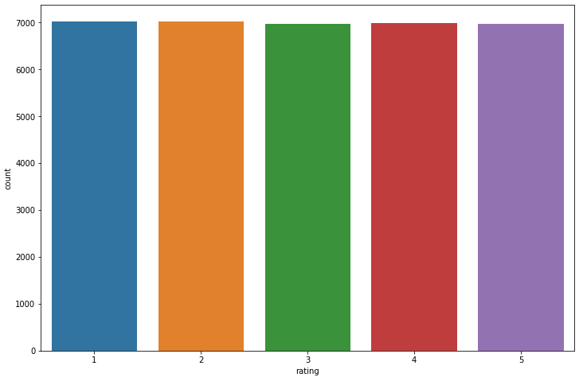
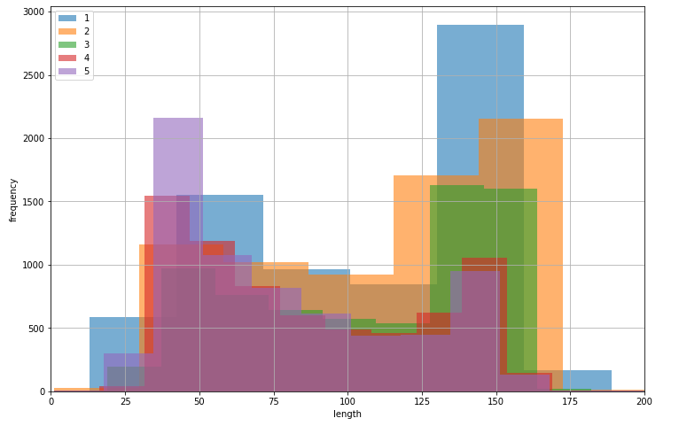
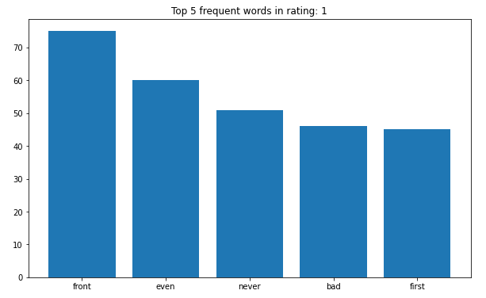
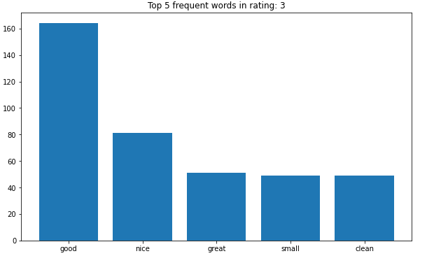
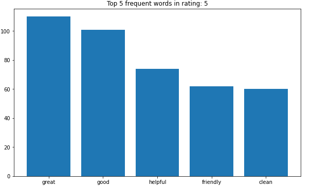
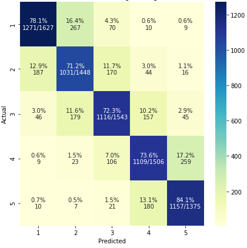
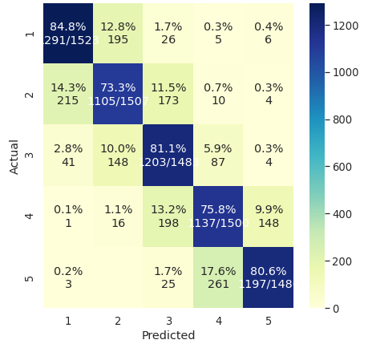

# Hotel Reviews Sentiment Analysis
This project aims to classify ratings of the hotel reviews. There are 5 ratings (i.e., class) in the dataset along with the reviews. The dataset is quite balanced among the 5 classes. The objective is to develop two different classification models i.e., a baseline and a state of the art(SOTA) model to compare the performance of classifying ratings. To uncover interesting insights from the data, different exploratory analyses have been performed. Also, the dataset includes unstructured data (i.e., reviews) which need further conversion (e.g.,vectorization) before this can be used in any machine learning model. Different approaches have been followed for developing the models.

Baseline Model (TF-IDF + Logistic Regression): The baseline model consists of a simple vectorization (i.e., feature engineering) approach using TF-IDF. The resultant vectorized texts are then used for classification using Logistic Regression. Overall, 75.8 % accuracy is achieved from this model.   

SOTA Model (RoBERTa): The SOTA model leverages transfer learning and a custom RoBERTa model to classify the reviews. Overall, 79% accuracy is achieved from this model.

• The base model uses Tf-Idf and logistic regression. 
• Pytorch is used to develop the SOTA model. 
• The SOTA model uses Hugging face 'roberta-base' pretrained model. 
• Dropout has been performed to reduce overfitting. 
• The best model(SOTA) achieves 79% accuracy. 

# Data Analysis and Performance
### Class Distribution

### Length Distribution

### Frequently appeared words

### Performance baseline model

### Performance sota model

# Remarks
• Analyzing the performance it is clear that the models are mostly strrugling in classifying intermediary sentiment classes (i.e.rating 2 & 4).  
• From the proof of concept analysis, it has been seen that the reviews within those classes consist of similar words.  
• Therefore, to draw a clear boundary, one of the solutions can be integrating rating - 1 & 2 as Negative Sentiment, rating 3 as Neutral and rating 4 & 5 as Positive Sentiment.  

# How to run:

1) The holdout data with the predictions can be found in the holdout_data directory.

2) Baseline model: Please check the hotel_reviews_sentiment_baseline.ipynb file for the detailed analysis. The trained baseline model can be loaded using the following command:

> pickle.load('model_baseline.pkl')

3) SOTA model: Please check the hotel_reviews_sentiment_sota.ipynb file for the detailed analysis. The trained sota model can be found in the following link:
https://drive.google.com/drive/folders/13jkm3cjuiEk-Y_vpnkgZYy4U33P-L5Gb?usp=sharing

It can be loaded using the following command:
> model = SentimentClassifier(5)

> model.load_state_dict(torch.load('model.bin'))
